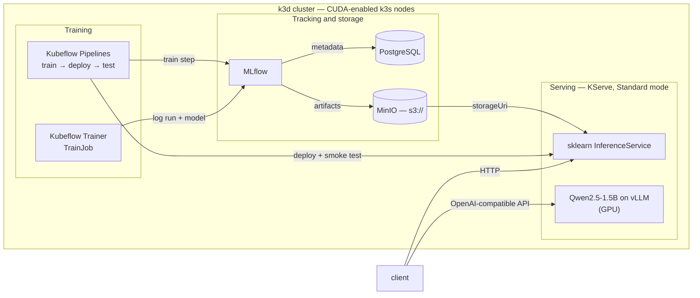

# mlops-platform-k8s

An end-to-end MLOps platform on a single machine: Kubernetes (k3d) running model
training, experiment tracking, model storage, and serving — including an LLM on the
local GPU — with a Kubeflow pipeline that trains a model, deploys it, and verifies it
answers.

Everything runs locally, is brought up with `make`, and is verified at each layer.



## What it demonstrates

- **Model serving on Kubernetes.** KServe in Standard mode: each `InferenceService`
  becomes a plain Deployment, Service and HPA, with no Knative or service mesh. Models
  are pulled from S3-compatible storage by KServe's storage-initializer; a custom
  `ServingRuntime` shows how runtime selection and priority work.
- **GPU infrastructure.** NVIDIA GPU passthrough into containerised Kubernetes nodes,
  through four layers: host toolkit, a custom CUDA-enabled k3s node image, a
  `RuntimeClass`, and the NVIDIA device plugin.
- **LLM serving.** Qwen2.5-1.5B-Instruct on vLLM, sized to fit an 8 GB laptop GPU,
  exposed through an OpenAI-compatible API.
- **Experiment tracking.** MLflow with PostgreSQL as its metadata store and MinIO as
  its artifact store.
- **Training and orchestration.** Training runs in-cluster as a Kubeflow `TrainJob`,
  and a Kubeflow Pipelines DAG trains a model, deploys it as an `InferenceService`,
  and smoke-tests the live endpoint — passing the model URI between steps at runtime.
- **Reproducibility.** One `make` target per stage, pinned versions throughout, and a
  verify-and-rollback procedure for every step.

## Results

| | |
| --- | --- |
| LLM on the laptop GPU | Qwen2.5-1.5B-Instruct, fp16, on an 8 GB RTX PRO 1000; 2.48 GiB KV cache (92,784 tokens) |
| First LLM start | ~9.5 min: >10 GB image, ~3 GB of weights, vLLM engine init |
| Pipeline run | train → deploy → smoke test in 2 min 16 s |

The trained model is deliberately trivial (Iris, logistic regression). The subject is
the platform around it.

## Stack

| Layer | Tool | Version |
| --- | --- | --- |
| Cluster | k3d / k3s | 5.9.0 / v1.35.5 |
| Certificates | cert-manager | v1.21.0 |
| Model serving | KServe, Standard mode | v0.19.0 |
| LLM runtime | vLLM, via KServe's huggingfaceserver | v0.19.0 image |
| Experiment tracking | MLflow | 3.16.0 |
| Metadata store | PostgreSQL | 16 |
| Object store | MinIO | RELEASE.2025-09-07 |
| Training | Kubeflow Trainer, with JobSet | v2.3.0 |
| Orchestration | Kubeflow Pipelines | 2.17.2 |
| GPU | NVIDIA Container Toolkit / CUDA base image | 1.20.0 / 13.0.1 |

## Quickstart

**Prerequisites:** Docker, `kubectl` 1.36+, `helm` 4+, `k3d` 5.9+, Python 3. For the
GPU path, an NVIDIA GPU with its driver and the
[NVIDIA Container Toolkit](docs/walkthrough.md#8a-host-nvidia-container-toolkit)
installed on the host.

```bash
make up              # CPU platform: cluster, KServe, MinIO, PostgreSQL, MLflow
# or
make gpu-up          # the same, on GPU-enabled nodes
make llm             # serve Qwen on vLLM (GPU path only)

make kubeflow        # Kubeflow Trainer + Pipelines
make trainjob        # train in-cluster; prints the run and its model URI
make pipeline-run    # train → deploy → smoke test, as a KFP pipeline
```

Call the model the pipeline deployed:

```bash
kubectl port-forward svc/iris-pipeline-predictor 8080:80
curl -s http://localhost:8080/v1/models/iris-pipeline:predict \
  -H "Content-Type: application/json" \
  -d '{"instances": [[6.8, 2.8, 4.8, 1.4], [6.0, 3.4, 4.5, 1.6]]}'
# {"predictions":[1,1]}
```

Or the LLM:

```bash
kubectl port-forward svc/qwen-llm-predictor 8090:80
curl -s http://localhost:8090/openai/v1/chat/completions \
  -H "Content-Type: application/json" \
  -d '{"model":"qwen-llm","messages":[{"role":"user","content":"What is KServe?"}],"max_tokens":120}'
```

Tear down with `make llm-down` (frees the GPU) or `make down` (deletes the cluster).

## Design decisions

- **KServe in Standard mode, not Knative.** Every object KServe generates is an
  ordinary Kubernetes resource, so a serving failure is debugged at one layer instead
  of four. The trade-off is no scale-to-zero and no built-in traffic splitting.
- **Standalone Kubeflow components, not the Kubeflow Platform.** The full platform
  bundles Istio and its own KServe configured for Knative mode, which would override
  the choice above. Trainer and Pipelines install on their own and need no mesh.
- **One training script, three contexts.** `train/train.py` runs unchanged on the
  host, as a `TrainJob`, and as a pipeline step. The pipeline adapts to the script's
  existing output rather than the script being adapted to the pipeline.
- **Pinned image tags.** Adopted after the upstream MinIO images disappeared from
  Docker Hub and broke a `:latest` reference without warning.

## Engineering notes

The problems that took real diagnosis — most of them failed silently or pointed at
the wrong cause.

| Symptom | Root cause |
| --- | --- |
| GPU visible to the node container, but not to pods | The stock k3s image has no NVIDIA container runtime, so containerd cannot hand the device to a pod. Fixed with a CUDA-based k3s node image. |
| LLM would run out of GPU memory with no hint why | vLLM's flags are dashed while KServe's are underscored, and the server parses with `parse_known_args()`, so a misspelled flag is silently dropped and vLLM falls back to its defaults. |
| MinIO in `ImagePullBackOff`, with DNS and timeout errors | Not a network fault: the repository had been removed from Docker Hub. Moved to quay.io and pinned. |
| MLflow rejected in-cluster calls with `403 Invalid Host header` | MLflow 3's DNS-rebinding protection allowlists `Host` headers. |
| Fixing that made MLflow crash-loop, logging only clean shutdowns | The allowlist variable *replaces* the defaults, including the private IP ranges the kubelet's health probes use. |
| An sklearn model was served by an unexpected runtime | A namespaced `ServingRuntime` outranks a cluster-wide one at equal priority. |

Each is written up in full, with the diagnosis, in the [walkthrough](docs/walkthrough.md).

## Limitations and next steps

- **No ingress yet.** Models are reached by port-forward; ports 80/443 are reserved
  for a Gateway API `Gateway`.
- **One GPU, advertised per node.** k3d nodes share the host, so the single card is
  reported once per node; run one GPU workload at a time.
- **Local-only credentials.** MinIO and PostgreSQL use throwaway values committed in
  plain text, by design for a local environment.

Planned: Gateway API ingress; LoRA fine-tuning of Qwen with Kubeflow Trainer's
torchtune runtime; an accuracy gate and MLflow model registry in the pipeline;
monitoring for vLLM and KServe metrics.

## Repository layout

```
Makefile           one target per stage: up, gpu-up, llm, kubeflow, trainjob, pipeline-run
k3d/               cluster configs (CPU: cluster.yaml, GPU: cluster-gpu.yaml)
gpu/               CUDA-enabled k3s node image, RuntimeClass, NVIDIA device plugin
manifests/         MinIO, PostgreSQL, MLflow, serving runtimes, InferenceServices, Kubeflow jobs
mlflow/            MLflow server image
custom-runtime/    custom KServe ServingRuntime image
train/             training script and its TrainJob image
pipeline/          KFP pipeline definition, compiled spec, deploy and smoke-test steps
docs/              step-by-step build walkthrough
```

## Documentation

[docs/walkthrough.md](docs/walkthrough.md) is the full build, step by step: the
reasoning behind each component, the commands, and how to verify and roll back each
step.
