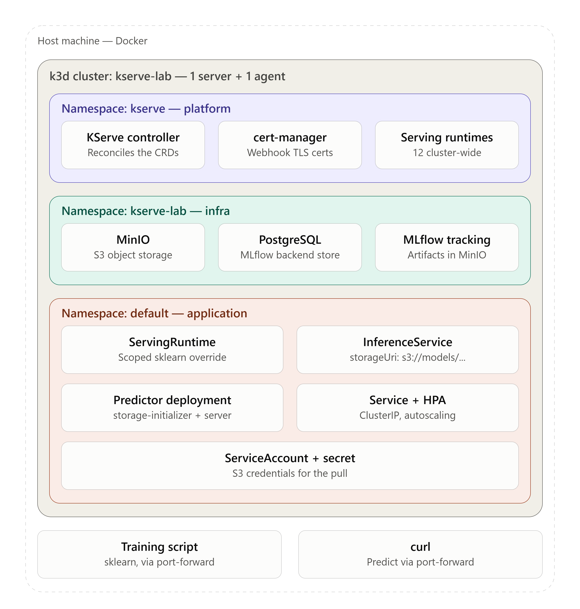
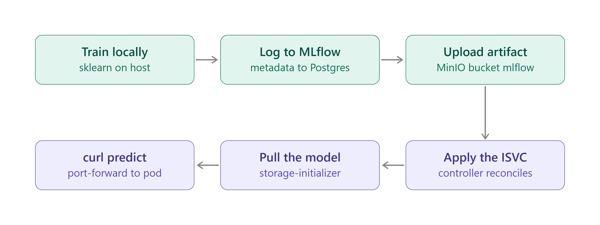

# KServe Local Lab

A local, from-scratch KServe setup running in **Standard** mode (no Knative/Istio),
with MinIO as artifact store, PostgreSQL as metadata store, and MLflow tracking wired
to both. End-to-end goal: train a scikit-learn model locally, log it to MLflow, serve
it from an `InferenceService` reading a `s3://` model URI, and call it with `curl`.

Stack: k3d · KServe (Standard/RawDeployment mode) · MinIO · PostgreSQL · MLflow.



## Prerequisites

- Docker
- `kubectl` v1.36+
- `helm` v4+
- `k3d` v5.9+
- Python 3 (for the local training step)

## Repository layout

```
k3d/               k3d cluster config
manifests/         Kubernetes manifests (MinIO, PostgreSQL, MLflow, ServingRuntimes, InferenceServices)
mlflow/            custom MLflow server image (Dockerfile)
custom-runtime/    custom KServe ServingRuntime image (Dockerfile + server)
train/             local training script and environment config
Makefile           up / down / reset targets consolidating all steps
```

---

## Step 1: Cluster: k3d, 1 server + 1 agent, Traefik disabled

k3d was chosen over kind/minikube: it's multi-node by default and ships
`local-path-provisioner`, `metrics-server`, and `coredns` out of the box (kind starts
from a blank slate; minikube is oriented around single-node workflows and adds its own
driver abstraction on top of Docker).

Cluster is defined declaratively in [`k3d/cluster.yaml`](k3d/cluster.yaml):
- 1 server + 1 agent node
- ports 80/443 mapped to the k3d load balancer, reserved for a Gateway API `Gateway`
  later (Traefik is disabled at boot to avoid fighting over those ports)
- default kubeconfig merge/context switch on create

```bash
k3d cluster create --config k3d/cluster.yaml --wait
```

If the kubeconfig doesn't merge automatically:
```bash
k3d kubeconfig merge kserve-lab --kubeconfig-merge-default --kubeconfig-switch-context
```

**Verify:**
```bash
kubectl get nodes -o wide                 # 2 nodes Ready: 1 control-plane, 1 worker
kubectl get pods -A                       # coredns, local-path-provisioner, metrics-server running; no traefik
kubectl get storageclass                  # local-path marked (default)
```

**Rollback:** `k3d cluster delete kserve-lab`

---

## Step 2: KServe, Standard mode

### 2a: cert-manager

KServe's admission webhooks require TLS certificates. cert-manager provisions and
rotates them via `Certificate`/`Issuer` CRDs it watches, writing the result into a
`Secret` mounted by the webhook `Service`. Its `cainjector` component watches for the
`cert-manager.io/inject-ca-from` annotation and auto-populates `caBundle` on KServe's
webhook configurations. This is why cert-manager must be installed and ready *before*
KServe.

```bash
kubectl apply -f https://github.com/cert-manager/cert-manager/releases/download/v1.21.0/cert-manager.yaml
kubectl wait --for=condition=Available --timeout=120s deployment --all -n cert-manager
```

**Rollback:** `kubectl delete -f https://github.com/cert-manager/cert-manager/releases/download/v1.21.0/cert-manager.yaml`

### 2b: KServe CRDs

As of KServe v0.19.0 the Helm charts are split (`kserve-crd`, `kserve-resources`, plus
LLM/local-model variants); there is no chart literally named `kserve` on GHCR.

```bash
helm install kserve-crd oci://ghcr.io/kserve/charts/kserve-crd --version v0.19.0 -n kserve --create-namespace
```

**Verify:**
```bash
kubectl get crds | grep kserve
```
Expect 6 CRDs: `inferenceservices`, `servingruntimes`, `clusterservingruntimes`,
`trainedmodels`, `inferencegraphs`, `clusterstoragecontainers` (the last maps URI
schemes such as `s3://` to a storage-initializer image/credential pattern, used in a
later step).

**Rollback:** `helm uninstall kserve-crd -n kserve`, safe only while no
`InferenceService` instances exist; deleting the CRDs afterward cascades and removes
any live instances.

### 2c: KServe controller in Standard mode

KServe supports two deployment modes: `Knative` (formerly `Serverless`, requires
Knative + Istio) and `Standard` (formerly `RawDeployment`), the latter reconciles an
`InferenceService` directly into a `Deployment` + `Service` + `HPA`, with no Knative
involved. `Standard` is KServe's own code-level default, but the Helm chart's
`values.yaml` explicitly overrides it to `Knative`, so it has to be set explicitly.
Note the chart nests all values under a top-level `kserve:` key:
`kserve.controller.deploymentMode`, not `controller.deploymentMode`.

```bash
helm install kserve oci://ghcr.io/kserve/charts/kserve-resources --version v0.19.0 -n kserve \
  --set kserve.controller.deploymentMode=Standard --wait
```

**Verify:**
```bash
kubectl get pods -n kserve
kubectl get configmap inferenceservice-config -n kserve -o jsonpath='{.data.deploy}'
# expect: {"defaultDeploymentMode": "Standard"}
kubectl get mutatingwebhookconfigurations,validatingwebhookconfigurations | grep kserve
```

**Rollback:** `helm uninstall kserve -n kserve`, leaves CRDs intact; existing
`InferenceService` objects become unreconciled until reinstalled.

### 2d: built-in ServingRuntimes

`ClusterServingRuntime` objects (cluster-scoped, matching an ISVC's `modelFormat` to
a runtime container image) ship in a separate chart, and are gated behind another
disabled-by-default flag, same pattern as 2c.

```bash
helm install kserve-runtimes oci://ghcr.io/kserve/charts/kserve-runtime-configs --version v0.19.0 -n kserve \
  --set kserve.servingruntime.enabled=true --wait
```

**Verify:** `kubectl get clusterservingruntimes`, expect 12 runtimes covering
`sklearn`, `xgboost`, `lightgbm`, `pytorch`, `tensorflow`, `huggingface`, `paddle`,
`pmml`, `tensorrt`. Three separate runtimes (`kserve-sklearnserver`, `kserve-mlserver`,
`kserve-predictiveserver`) all claim `sklearn`; how KServe picks among them when
multiple runtimes support the same format is covered in the custom `ServingRuntime`
step below.

**Rollback:** `helm uninstall kserve-runtimes -n kserve`

### 2e: smoke test: public sklearn-iris (`gs://`)

Manifest: [`manifests/smoke-test/sklearn-iris.yaml`](manifests/smoke-test/sklearn-iris.yaml),
a minimal `InferenceService` pointing `storageUri` at the public
`gs://kfserving-examples/models/sklearn/1.0/model`, with no deployment-mode annotation
needed since the cluster-wide default is already `Standard`.

```bash
kubectl apply -f manifests/smoke-test/sklearn-iris.yaml
kubectl get isvc sklearn-iris -w
```

**Reconciliation chain observed:** ISVC created, then KServe's ISVC reconciler matches
`modelFormat.name: sklearn` against the `ClusterServingRuntime` list, then because the
deployment mode is `Standard`, it generates the following directly (no Knative in the
loop):
- `Deployment/sklearn-iris-predictor`: pod has an init container
  (`storage-initializer`) that downloads the `gs://` model into a shared `emptyDir`,
  plus the main `kserve-container` running the matched runtime's server image
- `Service/sklearn-iris-predictor`: ClusterIP, port 80, selects the predictor pod
- `HorizontalPodAutoscaler/sklearn-iris-predictor`: targets that Deployment,
  min 1 / max 1 replicas by default, CPU-utilization metric

**Verify (object graph):**
```bash
kubectl get deploy,svc,hpa -l serving.kserve.io/inferenceservice=sklearn-iris
kubectl get pods -l serving.kserve.io/inferenceservice=sklearn-iris
```

**Verify (actual inference):** no ingress/Gateway is wired up yet, so reach the
predictor directly:
```bash
kubectl port-forward svc/sklearn-iris-predictor 8080:80
curl -s -H "Content-Type: application/json" \
  http://localhost:8080/v1/models/sklearn-iris:predict \
  -d '{"instances": [[6.8, 2.8, 4.8, 1.4], [6.0, 3.4, 4.5, 1.6]]}'
# {"predictions":[1,1]}
```

**Rollback:** `kubectl delete -f manifests/smoke-test/sklearn-iris.yaml`, cascades to
the generated Deployment/Service/HPA (owner references).

---

## Step 3: MinIO + S3 credential wiring for `storageUri`

> **On the credentials in this section:** `minio-root-credentials` and
> `s3-credentials` use plain, throwaway values (`minioadmin`/`minioadmin123`)
> committed directly in the manifests. This is intentional: these credentials only
> grant access to a MinIO server running inside an ephemeral local k3d cluster,
> unreachable from outside the Docker network on the machine it runs on. **Do not
> reuse this pattern for credentials that grant access to anything real or
> internet-reachable.**

### 3a: MinIO deployment

Deployed inside the cluster (namespace `kserve-lab`) so this lab's data stays fully
self-contained. Manifests: [`manifests/minio/`](manifests/minio/): `namespace.yaml`,
`secret.yaml` (root credentials), `pvc.yaml` (5Gi on `local-path`),
`deployment.yaml`, `service.yaml`.

Single-replica MinIO with a `ReadWriteOnce` PVC uses `strategy: Recreate` instead of
the Deployment default `RollingUpdate`. `RollingUpdate` can try to start a new pod
before killing the old one, and with an RWO volume that leaves the new pod stuck
waiting for a volume the old pod still holds. `Recreate` kills first, then starts.

```bash
kubectl apply -f manifests/minio/namespace.yaml
kubectl apply -f manifests/minio/secret.yaml -f manifests/minio/pvc.yaml \
  -f manifests/minio/deployment.yaml -f manifests/minio/service.yaml
```

**Verify:** `kubectl get pods,pvc,svc -n kserve-lab`

**Rollback:** `kubectl delete -f manifests/minio/deployment.yaml -f manifests/minio/service.yaml -f manifests/minio/pvc.yaml -f manifests/minio/secret.yaml`
(scoped to MinIO's own manifests, not the namespace, since PostgreSQL and MLflow also
live in `kserve-lab` from Step 4 onward)

### 3b: buckets

```bash
kubectl apply -f manifests/minio/create-bucket-job.yaml
kubectl wait --for=condition=complete --timeout=60s job/minio-create-bucket -n kserve-lab
```
Creates `models` (direct `storageUri` testing) and `mlflow` (artifact root, used from
Step 4 onward) in one job.

**Rollback:** `kubectl delete job minio-create-bucket -n kserve-lab` (job only; buckets
persist until removed separately)

### 3c: S3 credentials for KServe

KServe's controller has a credential-builder that inspects the `ServiceAccount`
referenced by an ISVC's predictor, finds a `Secret` in that SA's `secrets:` list,
reads `serving.kserve.io/s3-*` annotations off it, and injects the resulting env vars
(`AWS_ACCESS_KEY_ID`, `AWS_SECRET_ACCESS_KEY`, `S3_ENDPOINT`, etc.) into the
`storage-initializer` init container.

Manifest: [`manifests/minio/s3-credentials.yaml`](manifests/minio/s3-credentials.yaml):
`Secret/s3-credentials` + `ServiceAccount/kserve-s3-sa`, both in `default`
(same namespace as the `InferenceService` that will reference them; the lookup is
namespace-scoped even though MinIO itself lives in `kserve-lab`, reachable via its
ClusterIP Service DNS name).

```bash
kubectl apply -f manifests/minio/s3-credentials.yaml
```

**Verify:** no visible effect until an ISVC sets
`spec.predictor.serviceAccountName: kserve-s3-sa`, validated in 3d below.

**Rollback:**
```bash
kubectl delete secret s3-credentials -n default
kubectl delete serviceaccount kserve-s3-sa -n default
```

### 3d: smoke test: `s3://` wiring

To validate the credential chain independently of the (not yet built) MLflow
training loop, [`manifests/minio/seed-model-job.yaml`](manifests/minio/seed-model-job.yaml)
downloads the same public sklearn-iris model artifact used in the Step 2 smoke test
and uploads it into `s3://models/sklearn-iris/model.joblib`, a throwaway artifact,
not a real trained model.

```bash
kubectl apply -f manifests/minio/seed-model-job.yaml
kubectl wait --for=condition=complete --timeout=60s job/minio-seed-model -n kserve-lab

kubectl apply -f manifests/smoke-test/sklearn-iris-s3.yaml
kubectl get isvc sklearn-iris-s3 -w
```

[`manifests/smoke-test/sklearn-iris-s3.yaml`](manifests/smoke-test/sklearn-iris-s3.yaml)
is identical to the Step 2 ISVC except `storageUri: s3://models/sklearn-iris` and
`serviceAccountName: kserve-s3-sa`. Reached `READY: True` in ~24s, confirming the
`storage-initializer` authenticated against MinIO successfully.

```bash
kubectl port-forward svc/sklearn-iris-s3-predictor 8081:80
curl -s -H "Content-Type: application/json" \
  http://localhost:8081/v1/models/sklearn-iris-s3:predict \
  -d '{"instances": [[6.8, 2.8, 4.8, 1.4], [6.0, 3.4, 4.5, 1.6]]}'
# {"predictions":[1,1]}
```

If credentials are wrong, the ISVC sits at `READY: False` and
`kubectl logs -l serving.kserve.io/inferenceservice=<name> -c storage-initializer`
shows an S3 auth error.

**Rollback:** `kubectl delete -f manifests/smoke-test/sklearn-iris-s3.yaml`

---

## Step 4: PostgreSQL + MLflow

### 4a: PostgreSQL

Same pattern as MinIO: `Secret`/`PVC`/`Deployment`/`Service` in `kserve-lab`,
`Recreate` strategy for the same `ReadWriteOnce`-volume reason. Manifests:
[`manifests/postgres/`](manifests/postgres/).

The data volume mount uses `subPath: pgdata` rather than mounting the PVC at
`/var/lib/postgresql/data` directly: `local-path-provisioner` volumes can contain
pre-existing entries at the mount root, and Postgres refuses to initialize a data
directory that isn't completely empty; `subPath` gives it a clean subdirectory.

```bash
kubectl apply -f manifests/postgres/secret.yaml -f manifests/postgres/pvc.yaml \
  -f manifests/postgres/deployment.yaml -f manifests/postgres/service.yaml
```

**Verify:** `kubectl exec -n kserve-lab deploy/postgres -- pg_isready -U mlflow`

**Rollback:** `kubectl delete -f manifests/postgres/`

### 4b: MLflow server image

The official `ghcr.io/mlflow/mlflow` image doesn't include the Postgres driver
(`psycopg2`) or S3 client (`boto3`) our backend-store/artifact-root combination needs,
so we build a small custom image: [`mlflow/Dockerfile`](mlflow/Dockerfile). Backend
store URI and artifact root are intentionally **not** baked into the image, passed as
container args at deploy time instead, keeping the image itself generic.

```bash
docker build -t mlflow-lab:latest mlflow/
k3d image import mlflow-lab:latest -c kserve-lab
```

`k3d image import` loads the locally-built image directly into each node's containerd
content store, no container registry involved, which matters since this image only
ever needs to exist on this one cluster.

**Gotcha:** Kubernetes defaults `imagePullPolicy` to `Always` for any `:latest`-tagged
image. Without explicitly setting `imagePullPolicy: Never` on the Deployment, the
kubelet tries to pull `mlflow-lab:latest` from a real registry and fails with
`ImagePullBackOff`, since the image only exists locally via the import above.

### 4c: MLflow Deployment + Service

Manifests: [`manifests/mlflow/`](manifests/mlflow/). MLflow is run in its default mode
(`--default-artifact-root`, no `--serve-artifacts` proxying); the tracking server
only records the artifact URI in Postgres, and actual artifact upload/download happens
client-side, directly between whatever logs to MLflow and MinIO. This is why the
MLflow server pod itself needs no S3 credentials, only the Postgres and S3 *locations*
(both reached via in-cluster Service DNS names).

```bash
kubectl apply -f manifests/mlflow/deployment.yaml -f manifests/mlflow/service.yaml
```

**Verify:** don't trust `/` (a static SPA shell); confirm the Postgres wiring through
the actual tracking API:
```bash
kubectl port-forward -n kserve-lab svc/mlflow 5000:5000
curl -s http://localhost:5000/api/2.0/mlflow/experiments/search -X POST \
  -H "Content-Type: application/json" -d '{"max_results": 10}'
```
Expect the `Default` experiment (`experiment_id: "0"`), which only exists if MLflow
successfully initialized its schema in Postgres on startup; confirmed
`artifact_location: "s3://mlflow/0"` too, proving `--default-artifact-root` took
effect.

**Rollback:** `kubectl delete -f manifests/mlflow/`

---

## Step 5: Full loop: train → MLflow → `InferenceService` → `curl`



### 5a: local training environment

Training runs on the host, not in-cluster, so it needs network access to both MLflow
(tracking API) and MinIO (artifact upload via boto3 inside the MLflow client): two
separate port-forwards, left running for the duration of training:
```bash
kubectl port-forward -n kserve-lab svc/mlflow 5000:5000
kubectl port-forward -n kserve-lab svc/minio 9010:9000
```

Local Python env (kept inside the project, not system-wide):
```bash
python3 -m venv .venv && source .venv/bin/activate
pip install mlflow scikit-learn boto3 python-dotenv
```

Config loaded from [`train/.env`](train/.env) (gitignored) via
[`train/.env.example`](train/.env.example) as the checked-in template.

### 5b: training script

[`train/train.py`](train/train.py): loads iris, trains a `LogisticRegression`, logs
params/metrics/model to MLflow, and prints the model's `storageUri`:

```bash
python train/train.py
# model artifact_path (storageUri): s3://mlflow/1/models/m-<id>/artifacts
```

### 5c: the real InferenceService

[`manifests/smoke-test/sklearn-iris-mlflow.yaml`](manifests/smoke-test/sklearn-iris-mlflow.yaml):
identical shape to the Step 3d ISVC (same `kserve-s3-sa`, same bucket, no new
credential setup needed), `storageUri` set to the `model_info.artifact_path` value
above.

```bash
kubectl apply -f manifests/smoke-test/sklearn-iris-mlflow.yaml
kubectl get isvc sklearn-iris-mlflow -w
```

**Verify:**
```bash
kubectl port-forward svc/sklearn-iris-mlflow-predictor 8082:80
curl -s -H "Content-Type: application/json" \
  http://localhost:8082/v1/models/sklearn-iris-mlflow:predict \
  -d '{"instances": [[6.8, 2.8, 4.8, 1.4], [6.0, 3.4, 4.5, 1.6]]}'
# {"predictions":[1,1]}
```

**Rollback:** `kubectl delete -f manifests/smoke-test/sklearn-iris-mlflow.yaml`

---

## Step 6: Custom `ServingRuntime` and `modelFormat` matching

### 6a: how runtime selection actually works

Three built-in `ClusterServingRuntime`s all claim `sklearn`
(`kserve-sklearnserver`, `kserve-mlserver`, `kserve-predictiveserver`). Traced the
actual selection algorithm in `ModelSpec.GetSupportingRuntimes`
(`pkg/apis/serving/v1beta1/predictor_model.go`), rather than assuming:

1. List namespace-scoped `ServingRuntime`s (in the ISVC's namespace) and
   cluster-scoped `ClusterServingRuntime`s separately:
   ```bash
   kubectl get servingruntime -n default
   kubectl get clusterservingruntime
   ```
2. Filter each to runtimes that are not disabled, match MMS/multinode mode, and pass
   `RuntimeSupportsModel`: a runtime's format is only eligible for *automatic*
   matching if `autoSelect: true` (or the ISVC names that runtime explicitly via
   `spec.predictor.model.runtime`):
   ```bash
   kubectl get clusterservingruntime -o custom-columns='NAME:.metadata.name,DISABLED:.spec.disabled,MULTIMODEL:.spec.multiModel'
   kubectl get clusterservingruntime -o custom-columns='NAME:.metadata.name,AUTOSELECT:.spec.supportedModelFormats[?(@.name=="sklearn")].autoSelect'
   ```
3. Filter by protocol version support (`IsProtocolVersionSupported`):
   ```bash
   kubectl get clusterservingruntime -o custom-columns='NAME:.metadata.name,PROTOCOLS:.spec.protocolVersions'
   ```
4. Sort survivors by `priority` for that model format: higher wins; a runtime with
   no priority always loses to one that declares any:
   ```bash
   kubectl get clusterservingruntime -o custom-columns='NAME:.metadata.name,PRIORITY:.spec.supportedModelFormats[?(@.name=="sklearn")].priority'
   ```
5. **Namespace-scoped results are always listed ahead of cluster-scoped ones**,
   regardless of priority value: `srSpecs = append(srSpecs, clusterSrSpecs...)`.
   Scope beats priority unconditionally. No single `kubectl` query proves an
   ordering rule enforced in controller code; verified instead by outcome: creating
   a namespace-scoped `ServingRuntime` for the same format (6b below) and confirming
   which image the resulting pod actually runs.
6. First entry in the combined list wins, confirmed via:
   ```bash
   kubectl get pod -l serving.kserve.io/inferenceservice=<name> -o jsonpath='{.items[0].spec.containers[0].image}'
   ```

Verified against the real cluster, of the three runtimes claiming `sklearn`:

| runtime | priority | autoSelect | protocols | result |
|---|---|---|---|---|
| `kserve-predictiveserver` | 3 | `false` | v1, v2 | eliminated: not auto-selectable |
| `kserve-mlserver` | 2 | `true` | v2 only | eliminated: our ISVCs use the v1 `:predict` path |
| `kserve-sklearnserver` | 1 | `true` | v1, v2 | **only survivor, actually used** |

`kserve-sklearnserver` won despite having the *lowest* priority of the three:
priority only matters as a tie-breaker among runtimes that already passed the
`autoSelect` and protocol-version filters, and here it was the only one left.

### 6b: building a real custom `ServingRuntime`

To prove the namespace-scope-wins rule (item 5 in the algorithm above) rather than
just read about it,
built a from-scratch runtime, not a copy of KServe's own sklearnserver package, and
registered it as a namespace-scoped `ServingRuntime` in `default`, intending it to
override the cluster-scoped `kserve-sklearnserver` for every ISVC in that namespace
without needing to name it explicitly.

The container contract was reverse-engineered from the real
`kserve-sklearnserver` `ClusterServingRuntime` object (`kubectl get
clusterservingruntime kserve-sklearnserver -o yaml`) rather than assumed:
- container must be named exactly `kserve-container` (the controller merges
  ISVC-level overrides into a container with this specific name)
- args follow a templated convention: `--model_name={{.Name}}` (KServe substitutes
  the ISVC's name at reconcile time), `--model_dir=/mnt/models` (fixed path, where
  the `storage-initializer` init container drops the downloaded model into a shared
  `emptyDir` the controller wires up automatically), `--http_port=8080`

[`custom-runtime/server.py`](custom-runtime/server.py): a minimal FastAPI app
implementing the same contract: loads a `.joblib`/`.pkl`/`.pickle` file from
`--model_dir`, serves `GET /v1/models/<name>` (readiness) and
`POST /v1/models/<name>:predict`. Its response includes a `served_by` marker field
that KServe's own runtimes never return, the only way to prove *this* code, not the
built-in image, actually handled a request.

[`manifests/custom-runtime/servingruntime.yaml`](manifests/custom-runtime/servingruntime.yaml):
namespace-scoped `ServingRuntime` in `default`, `autoSelect: true`,
`protocolVersions: [v1]`.

```bash
docker build -t custom-sklearn-runtime:latest custom-runtime/
k3d image import custom-sklearn-runtime:latest -c kserve-lab
kubectl apply -f manifests/custom-runtime/servingruntime.yaml
```

**Verify runtime registration:** `kubectl get servingruntime -n default`

[`manifests/smoke-test/sklearn-iris-custom-runtime.yaml`](manifests/smoke-test/sklearn-iris-custom-runtime.yaml):
same shape as the Step 5c ISVC, deliberately **not** naming a runtime explicitly, to
prove the override happens automatically rather than because it was forced:

```bash
kubectl apply -f manifests/smoke-test/sklearn-iris-custom-runtime.yaml
kubectl get isvc sklearn-iris-custom-runtime -w
```

**Verify (object level):**
```bash
kubectl get pod -l serving.kserve.io/inferenceservice=sklearn-iris-custom-runtime \
  -o jsonpath='{.items[0].spec.containers[0].image}'
# custom-sklearn-runtime:latest, not kserve/sklearnserver:v0.19.0
```

**Verify (actual inference):**
```bash
kubectl port-forward svc/sklearn-iris-custom-runtime-predictor 8083:80
curl -s -H "Content-Type: application/json" \
  http://localhost:8083/v1/models/sklearn-iris-custom-runtime:predict \
  -d '{"instances": [[6.8, 2.8, 4.8, 1.4], [6.0, 3.4, 4.5, 1.6]]}'
# {"predictions":[1,1],"served_by":"custom-sklearn-runtime-lab"}
```

**Rollback:**
```bash
kubectl delete -f manifests/smoke-test/sklearn-iris-custom-runtime.yaml
kubectl delete -f manifests/custom-runtime/servingruntime.yaml
docker rmi custom-sklearn-runtime:latest
```

---

## Step 7: Makefile

[`Makefile`](Makefile) consolidates Steps 1-6 into one target per component
(`cluster`, `cert-manager`, `kserve-crd`, `kserve-controller`, `kserve-runtimes`,
`minio`, `postgres`, `mlflow`, `custom-runtime`), chained by `up`:

```bash
make up      # idempotent, safe to re-run on an existing cluster
make down    # deletes the k3d cluster (cascades everything inside it)
make reset   # down + up
```

Training (Step 5) and the smoke-test `InferenceService`s are intentionally **not**
part of `up`; they're interactive exercises (local venv, foreground port-forwards),
not infrastructure. `up` gets the lab ready to use; training/serving a model is a
manual walkthrough, documented above.
